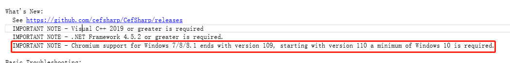

# 疑难问题

## 未解决

- ### 显示器共享获取名称时，可能截取字符出错（医疗电脑反馈）
- ### 带音频共享一段时间后，说话语音的质量下降（听不清）
- ### 多屏下，菜单栏操作辅流界面，重复操作，概率导致崩溃

------------------------------------------------------------------

## 已解决

### CEF向下兼容问题
调整版本方法：
```
https://www.cnblogs.com/GengMingYan/p/17324397.html
```




### 共享扩展屏时黑屏
问题原因：c#项目manifest配置问题，把兼容性注释代码放开即可

### 窗口共享异常
窗口测试情况：
- 1.sdk20.3.0.16：共享chrome后，远端看到黑屏只能看到鼠标
- 2.sdk21.6.1.1：同情况1
- 解决方法：
    ```
    https://blog.csdn.net/The_Lucky_one/article/details/107603443
    ```